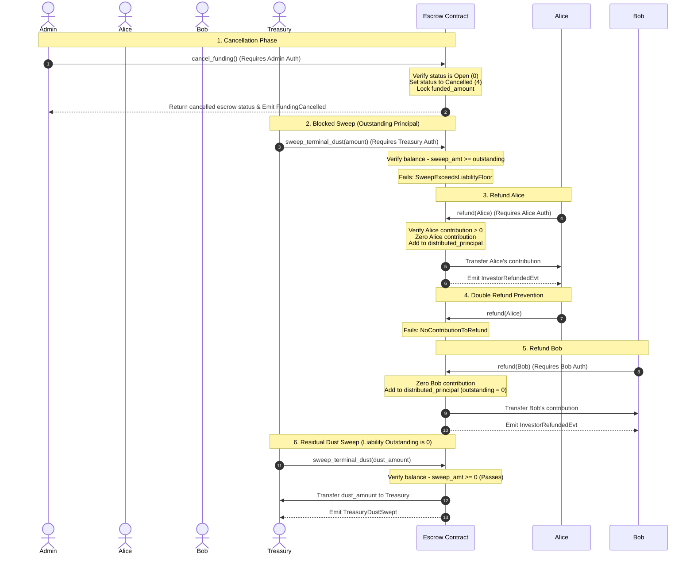

# Escrow Cancellation and Refund Lifecycle

This document provides a detailed end-to-end explanation of the cancellation, refund, and residual-sweep lifecycle of the LiquiFact Escrow contract. It explains how funding is cancelled, how investors claim refunds safely, and how the contract protects outstanding liabilities from being swept as dust.

---

## 1. Cancellation Lifecycle (`status` = 4)

When an escrow is open and active (status `0`), it accepts funding contributions from investors. If the project/invoice funding fails to reach its target or needs to be terminated early, the escrow can be transitioned into a terminal cancelled state.

### Triggering cancel_funding
- **Auth**: The [`InvoiceEscrow::admin`] is the only role authorized to call [`LiquifactEscrow::cancel_funding`](file:///c:/Users/enwer/OneDrive/Documents/Code%20Projects/OS%20Contributions/Liquifact-contracts/escrow/src/lib.rs#L3783).
- **Conditions**:
  - The escrow status must be exactly `0` (Open). Funded escrows (status `1`), settled escrows (status `2`), etc., cannot be cancelled.
  - No legal hold is active on the escrow (`legal_hold_active` must be `false`).
- **State Transition**:
  - The status is set to `4` (Cancelled).
  - A `FundingCancelled` event is published containing the `funded_amount` at the moment of cancellation.
- **Unlocks**:
  - Transitioning to status `4` unlocks the [`LiquifactEscrow::refund`](file:///c:/Users/enwer/OneDrive/Documents/Code%20Projects/OS%20Contributions/Liquifact-contracts/escrow/src/lib.rs#L3816) entrypoint for all contributing investors.
  - It also allows the treasury to call [`LiquifactEscrow::sweep_terminal_dust`](file:///c:/Users/enwer/OneDrive/Documents/Code%20Projects/OS%20Contributions/Liquifact-contracts/escrow/src/lib.rs#L1447) (subject to the liability floor).

---

## 2. Refund Mechanics

Once the escrow is cancelled, investors are entitled to claim their contributed principal back.

### Authorization & Safety
- **Auth**: Each investor must call [`LiquifactEscrow::refund`](file:///c:/Users/enwer/OneDrive/Documents/Code%20Projects/OS%20Contributions/Liquifact-contracts/escrow/src/lib.rs#L3816) themselves. The call requires `investor.require_auth()`.
- **Idempotency**: The refund logic uses the **Checks-Effects-Interactions** pattern to ensure idempotency and prevent double-spending:
  1. **Check**: The contract verifies that the investor's recorded contribution (stored in `DataKey::InvestorContribution`) is greater than zero.
  2. **Effect**: The investor's contribution is zeroed out, and `DataKey::InvestorRefunded(investor)` is set to `true`.
  3. **Interaction**: The contract transfers the principal back to the investor.
  Any subsequent call will fail at the first check, preventing double-refunds.
- **`DistributedPrincipal` Accounting**:
  - To coordinate with the dust sweep invariant, the contract increments `DataKey::DistributedPrincipal` atomically by the refunded amount on each successful call.
  - An `InvestorRefundedEvt` is published containing the investor's address and refunded amount.

---

## 3. Residual Dust Sweeping and the Liability Floor

The [`LiquifactEscrow::sweep_terminal_dust`](file:///c:/Users/enwer/OneDrive/Documents/Code%20Projects/OS%20Contributions/Liquifact-contracts/escrow/src/lib.rs#L1447) entrypoint is designed to allow the protocol treasury to recover rounding residue or accidental transfers. In a cancelled escrow, it enforces a strict **liability floor** to protect un-refunded investor funds.

### The Liability Floor Invariant
To prevent the treasury from sweeping funds that are still owed to investors, the contract enforces:
```text
outstanding = funded_amount - distributed_principal
assert balance - sweep_amt >= outstanding
```
- `funded_amount`: The total amount of funding recorded when the escrow was cancelled.
- `distributed_principal`: The total principal already returned to investors via `refund`.
- `outstanding`: The total principal still owed to investors who have not yet claimed their refund.
- `balance`: The contract's current funding token balance.

If the requested `sweep_amt` would make the remaining contract balance less than `outstanding`, the call panics with `SweepExceedsLiabilityFloor`.

### Operator Guidance for Leftover Dust
- **What is leftover dust?** It consists of accidental direct transfers to the contract address (bypassing the `fund` entrypoint) or minor rounding differences.
- **How to sweep?** The treasury can sweep this excess dust at any time after cancellation. Since the excess dust does not count toward the `outstanding` principal liability, sweeping it does not violate the liability floor.
- **After all refunds**: Once all investors have successfully refunded, `distributed_principal == funded_amount`, meaning `outstanding` becomes `0`. At this point, the entire remaining contract balance is considered dust and can be swept by the treasury.

---

## 4. Sequence Diagram



---

## 5. Worked Example

### Initial Setup
- **Funding Target**: 100,000 USDC
- **Investors**:
  - **Alice**: Funds 40,000 USDC
  - **Bob**: Funds 30,000 USDC
- **Accidental Transfer**: A third party accidentally transfers 5,000 USDC directly to the contract address.
- **Contract State**:
  - `funded_amount` = 70,000 USDC (contributions from Alice + Bob)
  - `balance` = 75,000 USDC (contributions + accidental dust)
  - `status` = 0 (Open)

---

### Step 1: Cancellation
The Admin calls `cancel_funding()`.
- **State Changes**:
  - `status` -> `4` (Cancelled)
  - `funded_amount` remains `70,000` USDC
  - `distributed_principal` = `0` USDC
  - `outstanding` liability = `70,000 - 0 = 70,000` USDC

---

### Step 2: Attempted Early Sweep of Principal (Blocked)
The Treasury attempts to sweep 10,000 USDC.
- **Invariants Check**:
  - `balance` = 75,000 USDC
  - `sweep_amt` = 10,000 USDC
  - `balance_after_sweep = 75,000 - 10,000 = 65,000` USDC
  - `outstanding` liability = 70,000 USDC
- **Result**: `65,000 < 70,000`. The sweep is **blocked** (`SweepExceedsLiabilityFloor`).

---

### Step 3: Sweep of Accidental Dust (Allowed)
The Treasury attempts to sweep the 5,000 USDC of accidental dust.
- **Invariants Check**:
  - `balance` = 75,000 USDC
  - `sweep_amt` = 5,000 USDC
  - `balance_after_sweep = 75,000 - 5,000 = 70,000` USDC
  - `outstanding` liability = 70,000 USDC
- **Result**: `70,000 >= 70,000`. The sweep is **successful**.
- **State Changes**:
  - Contract `balance` -> `70,000` USDC
  - 5,000 USDC is transferred to Treasury.

---

### Step 4: Alice Refunds
Alice calls `refund(Alice)`.
- **Checks**: Alice has `40,000` USDC contribution.
- **State Changes**:
  - Alice's contribution set to `0`.
  - `distributed_principal` -> `40,000` USDC.
  - `outstanding` liability -> `70,000 - 40,000 = 30,000` USDC.
  - Contract `balance` -> `30,000` USDC (after transferring 40,000 to Alice).

If Alice calls `refund(Alice)` again, the call is rejected (`NoContributionToRefund`).

---

### Step 5: Bob Refunds
Bob calls `refund(Bob)`.
- **Checks**: Bob has `30,000` USDC contribution.
- **State Changes**:
  - Bob's contribution set to `0`.
  - `distributed_principal` -> `40,000 + 30,000 = 70,000` USDC.
  - `outstanding` liability -> `70,000 - 70,000 = 0` USDC.
  - Contract `balance` -> `0` USDC (after transferring 30,000 to Bob).
